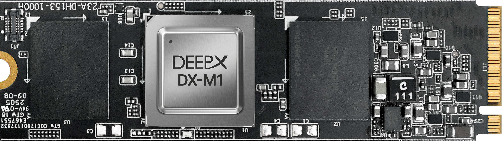
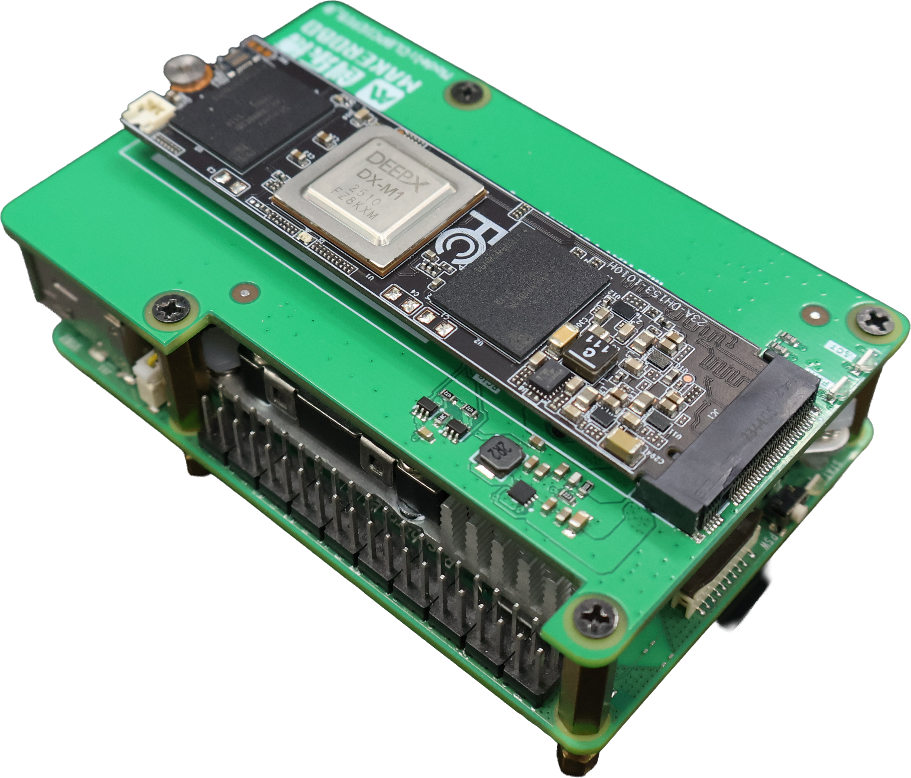

This chapter provides a technical overview of the DEEPX DX-M1 accelerator and its integration environment.

## Hardware Architecture: DX-M1 M.2 

The system utilizes a high-performance heterogeneous architecture specifically engineered to support demanding edge AI workloads.

### DX-M1 M.2 Accelerator Card Specifications

The DX-M1 is a high-efficiency AI inference accelerator designed for seamless integration into edge computing environments through its optimized internal architecture.  

  
  
Figure. DX-M1 M.2 Architecture

Table. DX-M1 M.2 Technical Specifications  

| Features | Details |
|---|---|
| AI Performance | 25 TOPS (INT8) |
| Host Interface | PCIe Gen3 x4 (Supports Gen 1/2/3 & x1/x2/x4) |
| Memory | 4GB LPDDR5 |
| Power Consumption | 5W (Typical) |
| Form Factor | M.2 2280 (M Key), 22 x 80 x 4.72 mm |
| OS Support | Windows 11/10 Debian-based Linux (Ubuntu 24.04/22.04/20.04 LTS), Docker  Yocto Linux |
| AI Frameworks | Ultralytics, PyTorch, TensorFlow, ONNX, Keras |
| System Support | x86 and ARM-based Architectures |

---

## Hardware Installation and I/O Setup

This section outlines the physical integration of the DEEPX DX-M1 accelerator. Follow these steps to ensure the host system and hardware components are properly configured for a stable edge AI environment.

### Step-by-Step Connection Guide

**Step 1. Raspberry Pi 5 Initial Setup**  

Complete the basic OS and power configuration by referring to the official documentation:  

- [Getting started with your Raspberry Pi](https://www.raspberrypi.com/documentation/computers/getting-started.html)  

**Step 2. Connecting the DX-M1 M.2 Module**  

Once the host is prepared, install the **DX-M1 M.2 NPU module** via the PCIe M.2 HAT as shown below.  
 

  
  
Figure. DEEPX DX-M1 AI Accelerator for Raspberry Pi 5

---
