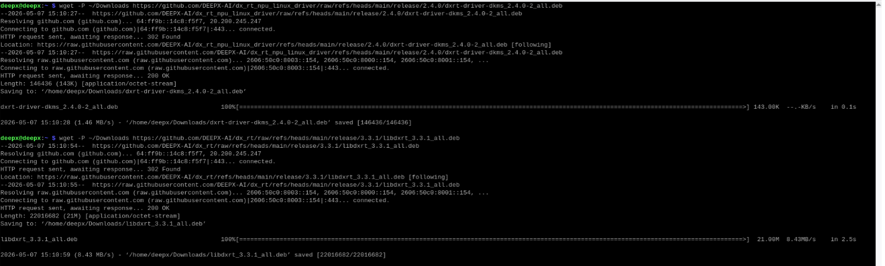
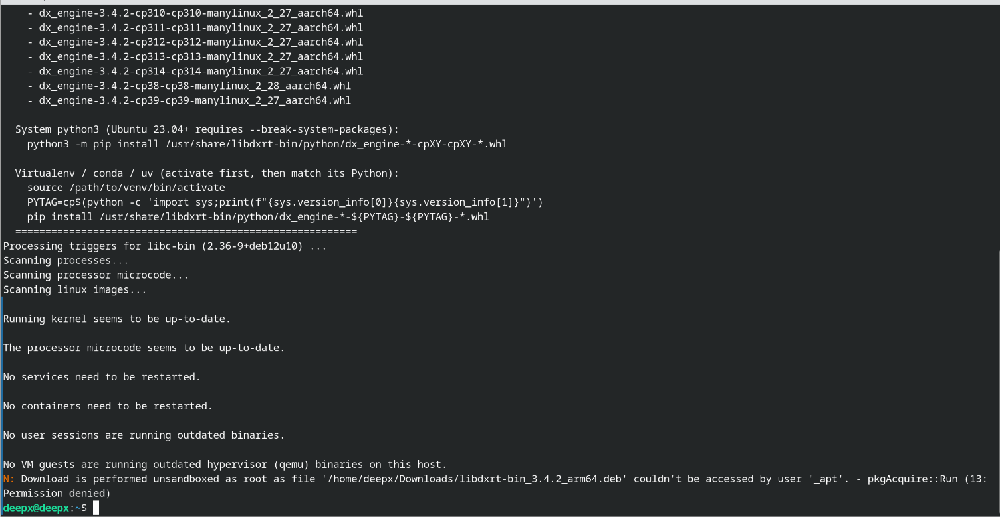
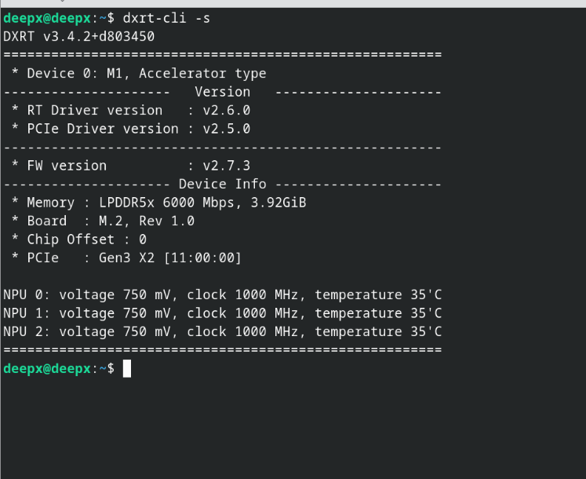
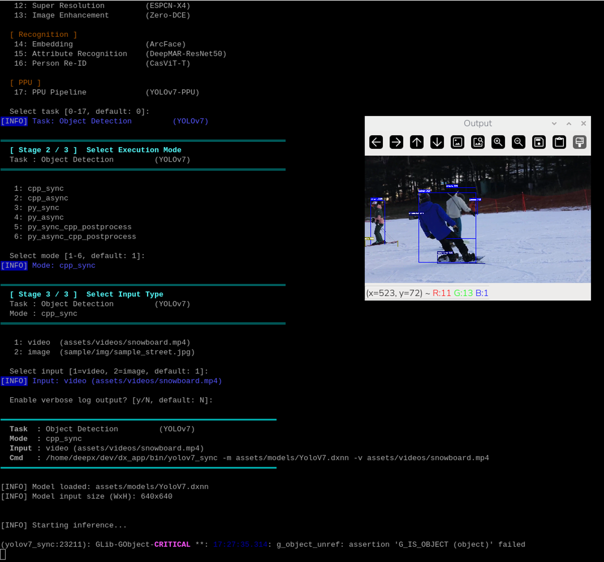
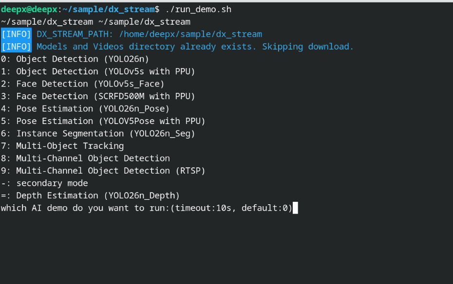
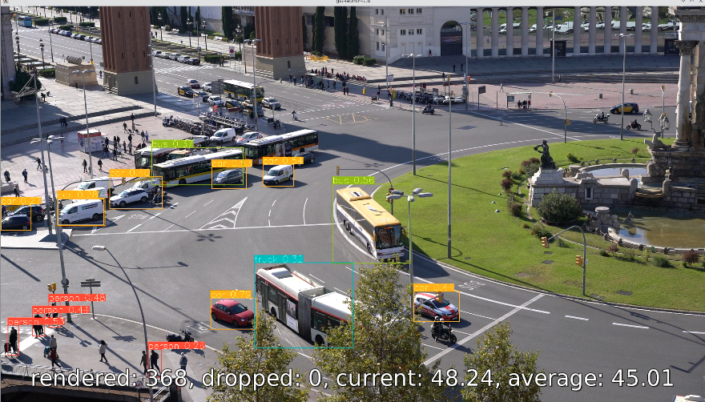
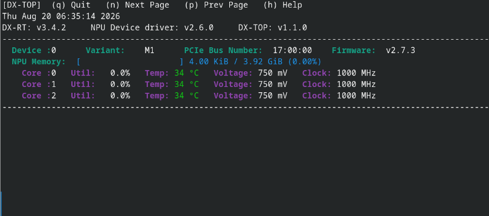

This chapter provides a concise guide to configuring the **DEEPX DX-M1** development environment. It covers the essential steps from verifying system requirements to executing your first AI inference benchmarks.  

## System Prerequisites

Before proceeding with the driver installation, ensure the host system is properly configured by following these environment preparation steps.  

### Environment Preparation

**Step 1. Install Raspberry Pi OS**  

- Download and install the OS using the **Raspberry Pi Imager**.  
- Link: [https://www.raspberrypi.com/software/](https://www.raspberrypi.com/software/)  

**Step 2. Connect to the Internet**  

- Verify that the Raspberry Pi has an active **Internet connection**.  
- A stable connection is required to access external repositories and download necessary dependencies during the setup process.  

---
 
## Software Setup and Demo Execution

This section provides a brief guide to installing the necessary drivers and executing AI inference benchmarks using the **DEEPX DX-M1** accelerator.  

### Install DEEPX M1 Driver and Runtime

Follow these steps to configure the official repository and install the **DEEPX Runtime (`DXRT`)** library, known as `libdxrt`, along with the necessary driver modules.  

**Step 1. Download the debian package**  

Execute the following commands to download latest debian package.  

```
# Download debian package to Download folder
$ wget -P ~/Downloads https://github.com/DEEPX-AI/dx_rt/raw/refs/heads/main/release/3.4.2/libdxrt-bin_3.4.2_arm64.deb

$ wget -P ~/Downloads https://github.com/DEEPX-AI/dx_rt_npu_linux_driver/raw/refs/heads/main/release/2.6.0/dxrt-driver-dkms_2.6.0-2_all.deb
```

<div align="left">
  
  <p>Figure. Download Debian package</p>
</div>


**Step 2. Installation of DXRT and Driver**  

Install the DEEPX Runtime (`DXRT`) library and the NPU driver.  

```
$ sudo apt install -y ~/Downloads/dxrt-driver-dkms_2.6.0-2_all.deb 
$ sudo apt install -y ~/Downloads/libdxrt-bin_3.4.2_arm64.deb
```

<div align="left" markdown="1">
  
  <p markdown="1">Figure. DEEPX Runtime Library (`libdxrt`) Installation Progress</p>
</div>


**Step 3. Hardware Status Verification**  

Confirm that the DX-M1 module is correctly interfaced and recognized by the system.  

```
$ dxrt-cli -s
```

<div align="left" markdown="1">
  
  <p>Figure. Hardware Verification using `dxrt-cli -s` Command</p>
</div>

### Optional: Firmware Update  

To ensure full compatibility between the `libdxrt` library and the hardware, the device firmware must meet the minimum version requirements.  

**Prerequisites for Update**  

Perform a firmware update if any of the following conditions occur.  

- **Version Mismatch:** The current firmware version is lower than the minimum requirement.  
- **Execution Error:** A `[dxrt-exception] Invalid Operation` error occurs during model execution.  

**Firmware Download**  

The latest firmware binaries and guides are available at the official DEEPX GitHub repository.  

- URL: [https://github.com/DEEPX-AI/dx_fw](https://github.com/DEEPX-AI/dx_fw)

**Quick Update Procedure**  

After downloading the firmware, execute the following commands.  

```
# Step 1. Stop service 
$ systemctl stop dxrt.service 

# Step 2. Update firmware 
$ dxrt-cli -u <path_to_fw_bin> 

# Step 3. Restart service 
$ systemctl start dxrt.service
```

!!! caution "CAUTION"  

    **Do not power off** the device during the update to prevent permanent hardware damage.  
 
### Execution of Sample Applications

**AI Inference Demo (`dx_app`)**  

The `dx_app` demonstrates real-time AI inference capabilities. The execution script automatically handles the acquisition of sample video assets and pre-compiled models.  

```
$ mkdir ~/sample
$ cd ~/sample
$ git clone --recurse-submodules https://github.com/DEEPX-AI/dx_app.git
$ cd dx_app
$ ./install.sh --all
$ ./run_demo.sh 
```

<div align="left" markdown="1">
  
  <p>Figure. `dx_app` Demo Output: Terminal Performance Summary (top) and Real-time Object Detection Result (bottom)</p>
</div>


**GStreamer Plugin Demo (`dx_stream`)**  

The `dx_stream` sample is optimized for high-performance video streaming pipelines utilizing the GStreamer framework.  

```
$ cd ~/sample
$ git clone --recurse-submodules https://github.com/DEEPX-AI/dx_stream.git
$ cd dx_stream
$ ./install.sh
$ ./build.sh
$ ./run_demo.sh 
```

<div align="left">
  
</div>

<div align="left" markdown="1">
  
  <p>Figure. `dx_stream` GStreamer Pipeline: Plugin menu selection (top) and multi-object detection result (bottom)</p>
</div>

### System Monitoring

**NPU Utilization (`dxtop`)**  

The `dxtop` utility provides a real-time CLI (Command Line Interface) to monitor NPU utilization, temperature, and operational status.  

```
$ dxtop
```

<div align="left" markdown="1">
  
  <p>Figure. Real-time NPU Resource Monitoring via `dxtop`</p>
</div>


### PCIe Gen3 Configuration

To maximize the throughput of the DX-M1 accelerator, it is recommended to manually force the interface to **PCIe Gen3**.  

**Manual Configuration via `config.txt`**  

This method involves editing the system configuration file to enforce Gen3 speeds manually.  

**Step 1. Open the configuration file**  

```
$ sudo nano /boot/firmware/config.txt
```

!!! note "NOTE"  

    In older versions of the OS, the path may be `/boot/config.txt`  

**Step 2. Add or modify the PCIe parameters**  

```
# Enable the PCIe external connector (M.2 HAT) 
dtparam=pciex1 

# Force PCIe Gen3 speed (Required for 25 TOPS performance) 
dtparam=pciex1_gen=3
```

**Step 3. Save and Exit**  

Press **Ctrl + O**, then **Enter** to save the changes, and Press **Ctrl + X** to exit the editor.  

**Step 4. Reboot the system**  

```
$ sudo reboot 
```

**Verification of PCIe Link Speed**  

After rebooting, you can verify if the PCIe Gen3 configuration has been applied correctly by checking the Link Status.  

```
$ lspci -vv | grep -i LnkSta:
```

- If the output shows **Speed 8GT/s**, the system is successfully operating at **PCIe Gen3** speeds.  
- If the output shows **Speed 5GT/s**, it is operating at **PCIe Gen2**.  

!!! note "NOTE"  

    To achieve the maximum AI performance of 25 TOPS, the link speed **must** be confirmed as **8GT/s**.

---
