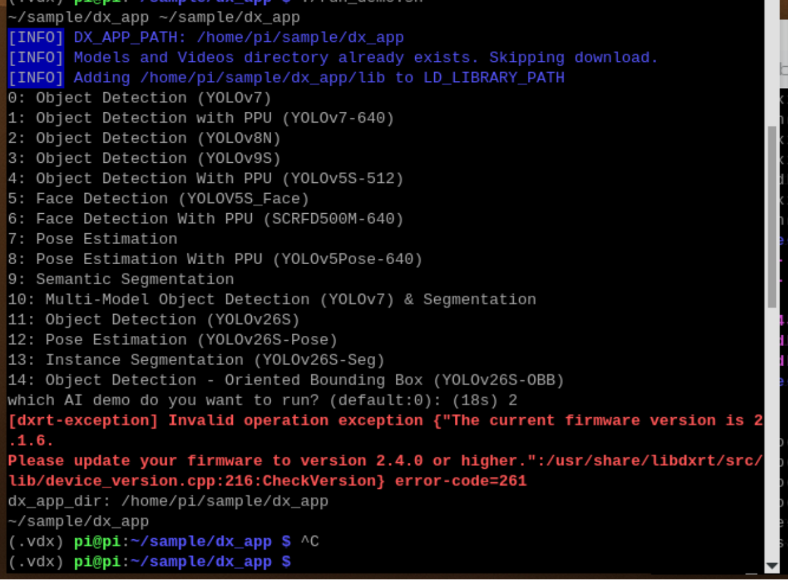

## Q1. Firmware Version Mismatch Error Message 

**Issue Description**  

When executing the AI demo application, the program terminates with a red `[dxrt-exception]` error message. This occurs when the current hardware firmware version is incompatible with the runtime library (`libdxrt`) requirements.  

  
  
Figure. Firmware Version Mismatch Error in Demo Execution

**Cause**  

- **Version Conflict:** The system has detected that the installed firmware is lower than the minimum required version needed.  

**Solution**  

- To resolve this, you must perform a manual firmware upgrade to ensure the hardware can communicate correctly with the latest SDK features. Refer to **Section. Optional: Firmware Update**.  
- If the issue persists after the firmware update, contact DEEPX Technical Support at [tech-support@deepx.ai](mailto:tech-support@deepx.ai).  

---
